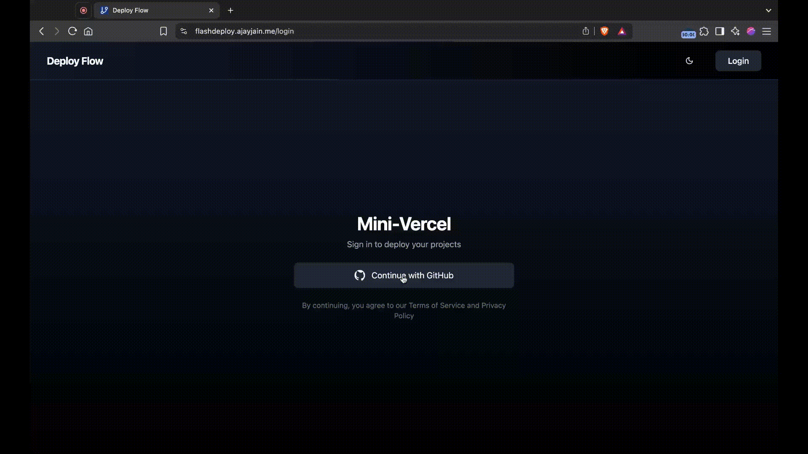

# FlashDeploy

A lightweight, Vercel‑inspired platform for one‑click frontend deployments from your GitHub repos. Instantly build in AWS-ECS containers, store on S3, and serve via custom subdomains using reverse proxy.

---

## 🎥 Demo

---

## Features

- **One‑click deployments** for React/Vite projects  
- **GitHub OAuth2** authentication 
- **Custom subdomains** (`<slug>.flashdeploy.ajayjain.me`)  
- **Containerized builds** on AWS ECS Fargate  
- **Static storage & delivery** via Amazon S3 + reverse proxy   
- **Cloudflare DNS** for subdomain routing 
- **Real‑time build status**  

---

## **⚙️ How It Works**  

```mermaid
flowchart LR
  A[User Logs in using GitHub OAuth] --> B[Fetch Repo & Trigger Build]
  B --> C[AWS ECS Spins Up Container]
  C --> D[Build & Upload to S3 Bucket]
  D --> E[Reverse‑proxy routes &lt;slug&gt;.flashdeploy.ajayjain.me → S3]
```

---

## Architecture

1. **Frontend (React + Tailwind CSS)**  
   - GitHub OAuth2 login  
   - Fetches user’s public and private repos  
   - Sends selected repo URL + custom slug to backend  

2. **Backend API (Node.js + Express)**  
   - Receives repo URL & slug  
   - Spawns an AWS ECS Fargate container  
   - Inside container:  
     - `git clone` → `npm install && npm run build`  
     - Upload `build/` to `s3://<bucket>/<slug>/`

3. **Reverse Proxy**  
   - Maps `<slug>.flashdeploy.ajayjain.me` → `/<slug>/` on S3  
   - Streams assets with correct headers  

4. **AWS Infrastructure**  
   - **ECS Fargate**: on‑demand, isolated build containers  
   - **S3**: cost‑effective static hosting  
   - **Cloudflare DNS**: subdomain routing  
---

## Tech Stack

- **Frontend:** React.js, Tailwind CSS  
- **Backend:** Node.js, Express, GitHub OAuth2  
- **Deployment:** Docker, AWS ECS Fargate, S3  
- **Networking:** HTTP‑proxy reverse proxy, Cloudflare DNS  

---
